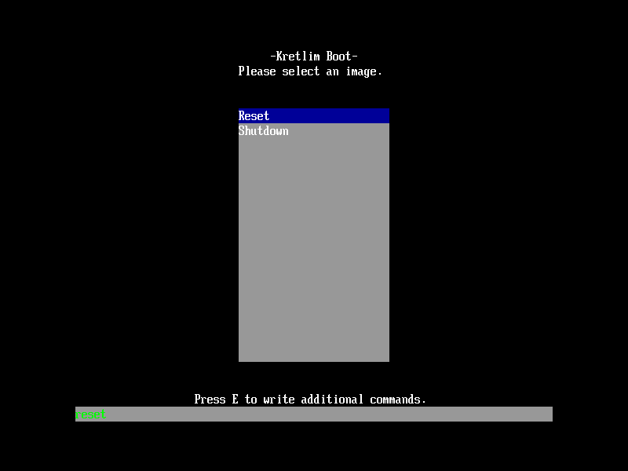

# kretlim-uefi-boot

This bootloader is aimed at simplifying the process of loading a 64bit kernel. It is done by making so all you need to do is compile your kernel with valid physical addresses, and we will make sure (using UEFI) to make sure you have a nice identity mapped area to work with. This will also give you the basics without having to change anything.

You can find the [boot protocol specs here](boot-protocol.md)

## Current Features
* cool looking boot menu
    * allows to select between different boot options
    * allows to modify the command line for each option
* kernel loading
    * elf64 binaries
    * can configure using the [boot config](https://github.com/kretlim/kretlim-boot-config)
* boot info that contains:
    * full EFI Memory Map
    * the framebuffer address and size
    * command line options
    * RSDP

## Requirements
* make
* clang-8

### Optional
* [requirements for kretlim boot config](https://github.com/kretlim/kretlim-boot-config) - for running
* qemu (for running)

## Building

### From another project
To build in another project you can simply include the `kretlim-uefi-boot.mk` file in your project and call `kretlim-uefi-boot` as a target, there is also `kretlim-uefi-boot-clean` for cleaning the build stuff, this will create an `BOOTX64.EFI` file in the bin folder

### Testing in qemu
Simply run `make qemu` and this should build everything to run in qemu, if you want just the image you can run `make image` or just `make`
