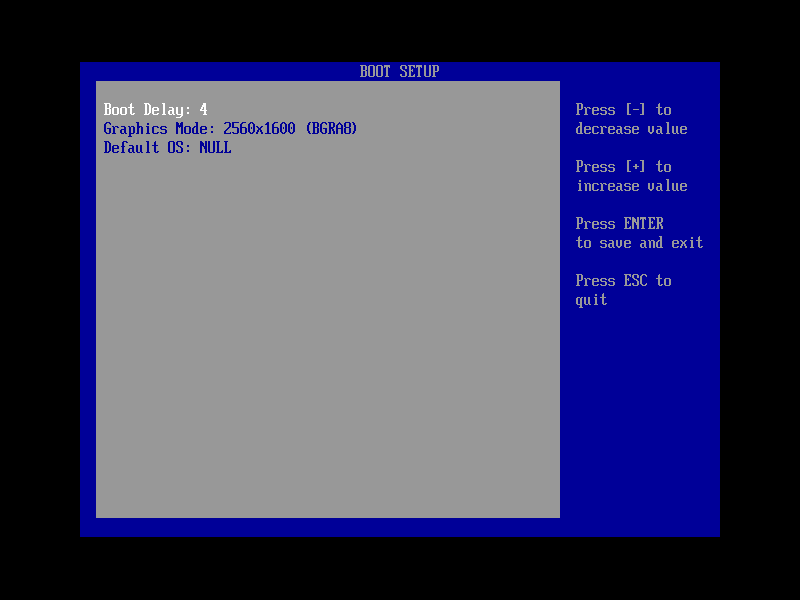
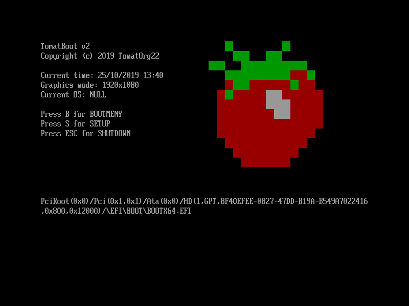

# TomatBoot for UEFI

TomatBoot is a simple kernel loader for 64bit UEFI based systems.

The idea of TomatBoot is to provide a simple interface for kernel developers to load their kernel into a 64bit environment 
(unlike most bootloaders which load you to 32bit). The reason for using a loader and not implementing UEFI directly is so
you won't have to mix UEFI and your kernel code.






## Features

* Boot menu
	* change width and height
	* change default entry and delay 
* Support for linux boot (WIP)
    * Can bootup TinyCore but it has problem with the initrd
* Custom boot protocol
    * Support for static ELF64 kernels
        * the kernel entry must be sysv abi
    * Passing boot information to the kernel
        * Command line
        * Framebuffer
        * ACPI table 
        * Memory Map (to be changed)
        * TSC frequency (ticks per second)
        * Boot modules (additional files to load)

### Future plans
* allow for modifying the command line on the fly
* support loading to another efi module
* pass boot device path

## Boot Protocol
### TomatBoot (`TBOOT`)
Currently this is the only supported boot protocol, the protocol is very simple, give a 64bit elf binary, we load it 
as a static binary, and call it with two parameters, one being a magic, and the other being the boot info struct.

For the header file with more definitions you can [click here](lib/tboot/tboot.h). 

### Linux Boot (`LINUX`)
With linux boot you can give TomatBoot a `vmlinuz` and `initrd` images and it will load it according to the linux 
boot protocol. 

* Currently to load the initrd just have any module, it will take the first one (will be changed to look at 
the module tag).

## How to

### Building
Being a loader it needs to be used in conjunction with another loader. For a project using TomatBoot you can see 
[TomatOS](https://github.com/TomatOrg/TomatOS).

Before anything we need to actually build the bootloader. To do so simply run the following:
```shell script
git clone git@github.com:TomatOrg/TomatBoot-UEFI.git
cd TomatBoot-UEFI
make
```

This will make the efi executable which will be found under `bin/BOOTX64.EFI`. in the final image you would want to 
place it under `EFI/BOOT/BOOTX64.EFI`. Of course you will need to make sure the image is GPT partitioned and has a 
EFI partition (in that partition you want to place the binary).

Example file structure inside the UEFI partition:
```
.
├── EFI
│   └── BOOT
│       └── BOOTX64.EFI
├── tomatboot.cfg
└── tomatos.elf
```

Other than the binary, you will also need to provide a configuration file. For an example you can see the 
[example config](config/linux.cfg). The config file needs to be placed at the root of the efi partition 
with the name `tomatboot.cfg`

### Config format
The configuration format is straight forward, it is a list of entries where each entry has the format:
```
:<name>
PATH=<path to elf executeable>
PROTOCOL={TBOOT,LINUX}
CMDLINE=<optional command line options>
MODULE=<tag 1>,<path 1>
MODULE=<tag 2>,<path 2>
...
```

little clarification on the module option, it can be found as many times as you want, the first part will be the tag to
assign that module, and the path is what file to load.

## UEFI Library

The uefi library consists mainly of headers and source files taken directly from [EDK2](https://github.com/tianocore/edk2). The reason for that is 
to cut on development time and use existing headers, but not using EDK2 build system.
