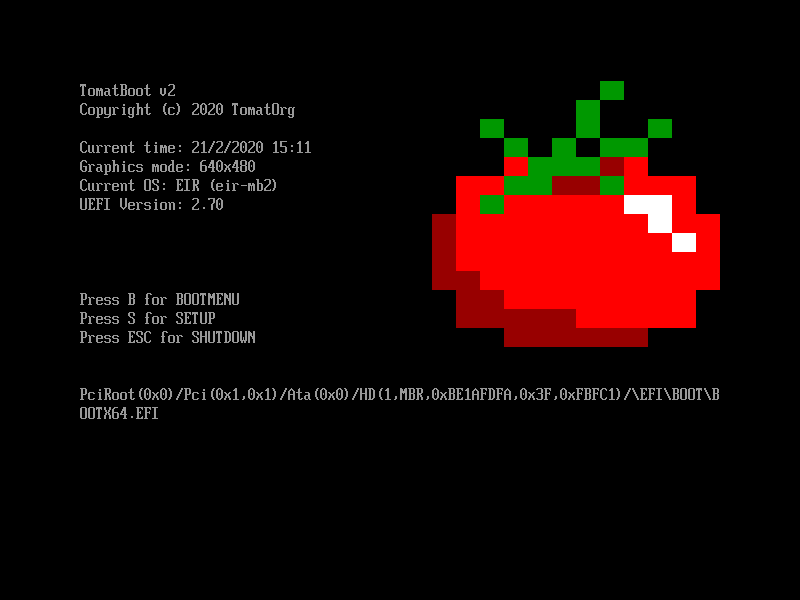
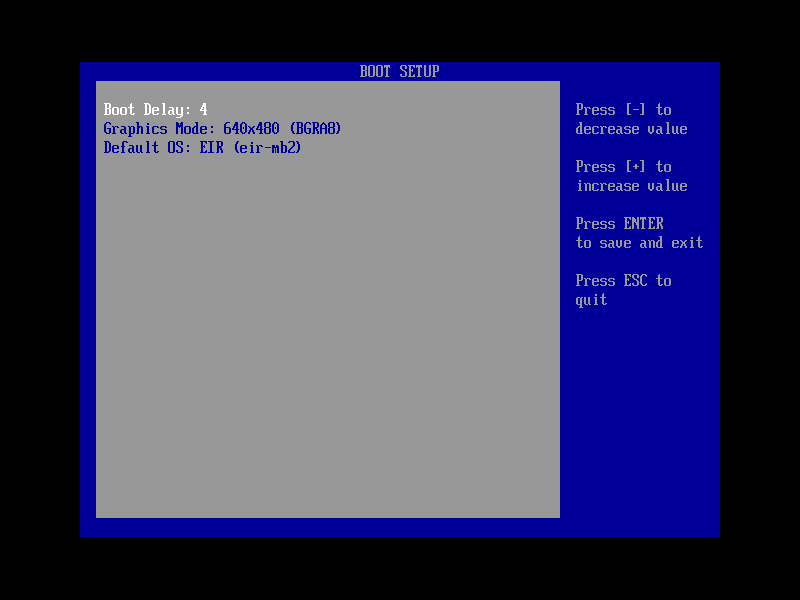

# TomatBoot for UEFI

TomatBoot is a simple kernel loader for 64bit UEFI based systems.





## Features

* Boot menu
	* change the framebuffer settings
	* change default entry and delay
* Support for linux boot
* Support for MB2

### Future plans
* allow to edit the configuration file on the fly
* tboot
    * pass the device path
    * relocatable kernel support

## Boot Protocol
### Linux Boot (`LINUX`)
With linux boot you can give TomatBoot a `vmlinuz` and `initrd` images and it will load it according to the linux 
boot protocol.

It supports both 32bit and a EFI Handover boot.

### Multiboot 2 (`MB2`)
With MB2 boot you can load any mb2 compatible kernel image.

We support:
* Command line
* Boot Modules
* E820 + Efi Memory Map
* ELF32/ELF64 Images + Elf Sections
* Framebuffer (Ignores the settings in the image)
* New/Old ACPI tables

## How to
### Getting the EFI module
First of all the latest EFI module is available to download [here]().

If you want to build from source then simply run:
```shell script
git clone git@github.com:TomatOrg/TomatBoot-UEFI.git
cd TomatBoot-UEFI
make
```

It will create the module and place it under `bin/BOOTX64.EFI`

### Creating an image
To create a bootable image you will need to have a GPT formatted image with one EFI FAT partition. You will 
need to place the UEFI module under `EFI/BOOT/BOOTX64.EFI` 

Other than the binary, you will also need to provide a configuration file. For an example you can see the 
[example config](config/example.cfg). The config file needs to be placed at the root of the efi partition 
with the name `tomatboot.cfg`


Example file structure inside the UEFI partition:
```
.
├── EFI
│   └── BOOT
│       └── BOOTX64.EFI
├── tomatboot.cfg
└── kernel.elf
```

### Config format
The configuration format is straight forward, it is a list of entries where each entry has the format:
```
:<name>
PATH=<path to elf executeable>
PROTOCOL={LINUX,MB2}
CMDLINE=<optional command line options>
MODULE=<tag 1>,<path 1>
MODULE=<tag 2>,<path 2>
...
```

little clarification on the module option, it can be found as many times as you want, the first part will be the tag to
assign that module, and the path is what file to load.

## UEFI Library

The uefi library consists mainly of headers and source files taken directly from [EDK2](https://github.com/tianocore/edk2). 
The reason for that is to cut on development time and use existing headers, but not using EDK2 build system.
